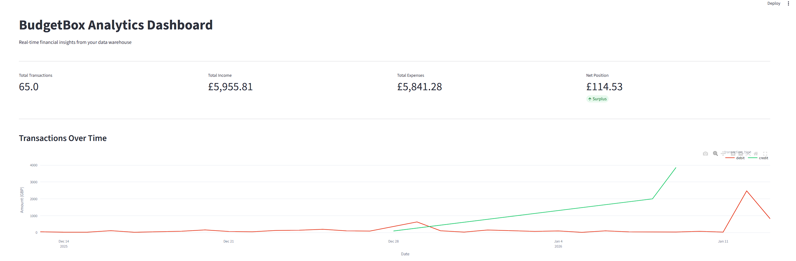
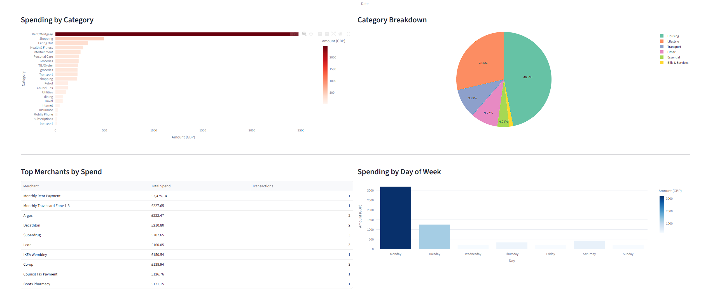
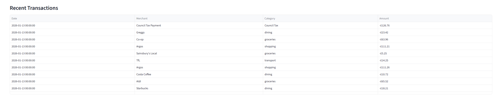

# BudgetBox Analytics Pipeline

A production-grade data engineering pipeline demonstrating end-to-end financial data processing. This project implements batch and real-time ingestion, dimensional modeling with dbt, orchestration with Airflow, and interactive analytics with Streamlit.

**Repository:** [https://github.com/Vincent-Ngobeh/budgetbox-pipeline](https://github.com/Vincent-Ngobeh/budgetbox-pipeline)

---

## Table of Contents

- [Architecture](#architecture)
- [Features](#features)
- [Tech Stack](#tech-stack)
- [Data Model](#data-model)
- [Project Structure](#project-structure)
- [Getting Started](#getting-started)
- [Usage](#usage)
- [Testing](#testing)
- [Dashboard](#dashboard)
- [Related Projects](#related-projects)
- [Author](#author)
- [License](#license)

---

## Architecture

```
                        INGESTION                      TRANSFORMATION              SERVING

    +------------------+                              +---------------+
    | Exchange Rates   |--+                          |    Staging    |
    | (Frankfurter API)|  |                          | stg_transactions
    +------------------+  |                          | stg_exchange_rates
                          |    +---------------+     +-------+-------+
    +------------------+  +--->|               |             |
    | Mock Transactions|------>|    DuckDB     |     +-------v-------+
    | (Batch Generator)|  +--->|   Warehouse   |     |  Intermediate |
    +------------------+  |    |               |     | int_transactions_with_gbp
                          |    +---------------+     +-------+-------+
    +------------------+  |           ^                      |
    |  Kafka Producer  |--+           |              +-------v-------+
    | (Real-time txns) |              |              |     Marts     |
    +------------------+              |              | fact_transactions
            |                         |              | dim_accounts
            v                         |              | dim_categories
    +------------------+              |              | dim_dates
    |  Kafka Consumer  |--------------+              +-------+-------+
    | (Batch writes)   |                                     |
    +------------------+                                     v
                                                    +------------------+
    +------------------+                            |    Streamlit     |
    |     Airflow      |--------------------------->|    Dashboard     |
    | (Orchestration)  |                            +------------------+
    +------------------+
```

### Data Flow

1. **Ingestion Layer**: Data enters from multiple sources - batch (API calls, mock data) and streaming (Kafka)
2. **Raw Layer**: Landing zone in DuckDB (`raw.transactions`, `raw.exchange_rates`)
3. **Staging Layer**: dbt views that clean and standardize raw data
4. **Intermediate Layer**: Business logic applied (currency conversion to GBP)
5. **Marts Layer**: Star schema dimensional model for analytics
6. **Serving Layer**: Streamlit dashboard queries the marts directly

---

## Features

### Data Ingestion
- Batch ingestion from Frankfurter API for daily exchange rates (GBP/USD/EUR)
- Mock transaction generator with realistic UK merchant data
- Real-time streaming via Kafka producer/consumer
- Idempotent loads with deduplication logic

### Transformation (dbt)
- Three-layer architecture: staging, intermediate, marts
- 65 data quality tests (uniqueness, not null, accepted values, relationships)
- Currency conversion with exchange rate lookups
- Incremental-ready model design

### Orchestration (Airflow)
- DAG orchestrating ingestion and dbt runs
- Parallel task execution for independent data sources
- Error handling and retry logic

### Streaming (Kafka)
- Producer generating real-time transaction events
- Consumer with batch writes to DuckDB
- Docker Compose setup with Kafka UI for monitoring

### Analytics (Streamlit)
- Interactive dashboard with KPI cards
- Time series analysis of income and expenses
- Category breakdown and merchant analysis
- Day-of-week spending patterns

---

## Tech Stack

| Component | Technology | Purpose |
|-----------|------------|---------|
| Orchestration | Apache Airflow 2.8+ | DAG scheduling and monitoring |
| Transformation | dbt-core 1.11+ | SQL-based data modeling |
| Warehouse | DuckDB | Embedded analytical database |
| Streaming | Apache Kafka | Real-time event processing |
| Visualization | Streamlit + Plotly | Interactive dashboards |
| Testing | pytest | Python unit and integration tests |
| Containerization | Docker Compose | Local Kafka infrastructure |

### Python Dependencies

```
apache-airflow==2.8.1
dbt-core==1.7.4
dbt-duckdb==1.7.1
duckdb==0.9.2
kafka-python-ng==2.2.2
streamlit==1.40.1
plotly==5.24.1
pandas==2.1.4
pytest==7.4.4
loguru==0.7.2
requests==2.31.0
faker==22.0.0
```

---

## Data Model

### Star Schema

```
                      +------------------+
                      |   dim_accounts   |
                      |------------------|
                      | account_key (PK) |
                      | account_id       |
                      | account_name     |
                      | account_type     |
                      | currency         |
                      +--------+---------+
                               |
+------------------+           |           +--------------------+
|    dim_dates     |           |           | fact_transactions  |
|------------------|           |           |--------------------|
| date_key (PK)    +-----------+-----------+ transaction_key(PK)|
| full_date        |                       | transaction_id     |
| day_name         |           +-----------+ date_key (FK)      |
| month_name       |           |           | account_key (FK)   |
| year_number      |           |           | category_key (FK)  |
| is_weekend       |           |           | amount             |
+------------------+           |           | amount_gbp         |
                               |           | signed_amount_gbp  |
                      +--------+---------+ | transaction_type   |
                      |  dim_categories  | | merchant           |
                      |------------------| | was_converted      |
                      | category_key (PK)| +--------------------+
                      | category_id      |
                      | category_name    |
                      | parent_category  |
                      | category_type    |
                      +------------------+
```

### Model Descriptions

| Model | Type | Description |
|-------|------|-------------|
| `stg_transactions` | View | Cleaned transaction data from raw layer |
| `stg_exchange_rates` | View | Standardized exchange rates with inverse rates |
| `int_transactions_with_gbp` | View | Transactions enriched with GBP conversion |
| `dim_dates` | Table | Date dimension spanning 2020-2026 |
| `dim_accounts` | Table | Account dimension from transaction data |
| `dim_categories` | Table | Category hierarchy with parent groupings |
| `fact_transactions` | Table | Central fact table with foreign keys to dimensions |

---

## Project Structure

```
budgetbox-pipeline/
|
|-- dags/
|   |-- __init__.py
|   |-- budgetbox_pipeline.py      # Main Airflow DAG
|
|-- dbt/
|   |-- budgetbox/
|       |-- dbt_project.yml
|       |-- profiles.yml
|       |-- models/
|           |-- staging/
|           |   |-- stg_transactions.sql
|           |   |-- stg_exchange_rates.sql
|           |   |-- sources.yml
|           |   |-- schema.yml
|           |-- intermediate/
|           |   |-- int_transactions_with_gbp.sql
|           |   |-- schema.yml
|           |-- marts/
|               |-- fact_transactions.sql
|               |-- dim_accounts.sql
|               |-- dim_categories.sql
|               |-- dim_dates.sql
|               |-- schema.yml
|
|-- ingestion/
|   |-- __init__.py
|   |-- base.py                    # Base ingestion class
|   |-- exchange_rates.py          # Frankfurter API integration
|   |-- mock_transactions.py       # Mock data generator
|
|-- streaming/
|   |-- __init__.py
|   |-- producer.py                # Kafka transaction producer
|   |-- consumer.py                # Kafka to DuckDB consumer
|
|-- dashboard/
|   |-- app.py                     # Streamlit application
|
|-- scripts/
|   |-- start_streaming.sh         # Start Kafka infrastructure
|   |-- stop_streaming.sh          # Stop Kafka infrastructure
|
|-- tests/
|   |-- __init__.py
|   |-- conftest.py                # pytest fixtures
|   |-- test_base_ingestion.py
|   |-- test_mock_transactions.py
|   |-- test_exchange_rates.py
|
|-- docs/
|   |-- images/                    # Dashboard screenshots
|
|-- data/                          # DuckDB database (gitignored)
|-- docker-compose.kafka.yml       # Kafka infrastructure
|-- requirements.txt
|-- pytest.ini
|-- README.md
```

---

## Getting Started

### Prerequisites

- Python 3.10+
- Docker and Docker Compose (for Kafka)
- Git

### Installation

1. Clone the repository:

```bash
git clone https://github.com/Vincent-Ngobeh/budgetbox-pipeline.git
cd budgetbox-pipeline
```

2. Create and activate a virtual environment:

```bash
python -m venv venv
source venv/bin/activate  # Linux/Mac
# or
venv\Scripts\activate     # Windows
```

3. Install dependencies:

```bash
pip install -r requirements.txt
```

4. Install dbt packages:

```bash
cd dbt/budgetbox
dbt deps
cd ../..
```

### Initialize the Data Warehouse

1. Run batch ingestion to populate raw data:

```bash
python -c "from ingestion.mock_transactions import ingest_mock_transactions; ingest_mock_transactions(num_transactions=100)"
python -c "from ingestion.exchange_rates import ingest_exchange_rates; ingest_exchange_rates()"
```

2. Run dbt models:

```bash
cd dbt/budgetbox
dbt run
dbt test
```

---

## Usage

### Run the Full Pipeline

With Airflow (requires Docker):

```bash
# Start Airflow
docker compose up -d

# Access Airflow UI at http://localhost:8080
# Username: airflow / Password: airflow

# Trigger the DAG manually or wait for scheduled run
```

Without Airflow (manual execution):

```bash
# 1. Ingest data
python -c "from ingestion.mock_transactions import ingest_mock_transactions; ingest_mock_transactions()"
python -c "from ingestion.exchange_rates import ingest_exchange_rates; ingest_exchange_rates()"

# 2. Transform with dbt
cd dbt/budgetbox && dbt run && dbt test
```

### Real-Time Streaming

1. Start Kafka infrastructure:

```bash
./scripts/start_streaming.sh
```

2. In one terminal, start the consumer:

```bash
python -m streaming.consumer
```

3. In another terminal, produce transactions:

```bash
python -m streaming.producer --num-transactions 50 --interval 0.5
```

4. Stop Kafka when done:

```bash
./scripts/stop_streaming.sh
```

### Launch the Dashboard

```bash
streamlit run dashboard/app.py
```

Access the dashboard at http://localhost:8501

---

## Testing

### Run All Tests

```bash
# Python tests
pytest tests/ -v

# dbt tests
cd dbt/budgetbox && dbt test
```

### Test Coverage

| Test Suite | Tests | Coverage |
|------------|-------|----------|
| `test_base_ingestion.py` | 8 | Base class functionality |
| `test_mock_transactions.py` | 13 | Transaction generator |
| `test_exchange_rates.py` | 13 | API integration |
| dbt schema tests | 65 | Data quality |
| **Total** | **99** | |

---

## Dashboard

The Streamlit dashboard provides interactive financial analytics:

### Overview and KPIs



### Category Analysis



### Transaction Details



---

## Related Projects

This pipeline complements the BudgetBox REST API:

- **BudgetBox API**: [https://github.com/Vincent-Ngobeh/budgetbox-api](https://github.com/Vincent-Ngobeh/budgetbox-api)
  - Django REST Framework backend for personal finance management
  - Live demo: [https://budgetbox-api-ckwq.onrender.com](https://budgetbox-api-ckwq.onrender.com)

---

## Author

**Vincent Sam Ngobeh**

- GitHub: [@Vincent-Ngobeh](https://github.com/Vincent-Ngobeh)
- LinkedIn: [Vincent Ngobeh](https://www.linkedin.com/in/vincent-ngobeh/)
- Email: vincentngobeh@gmail.com

---

## License

This project is licensed under the MIT License - see the [LICENSE](LICENSE) file for details.
